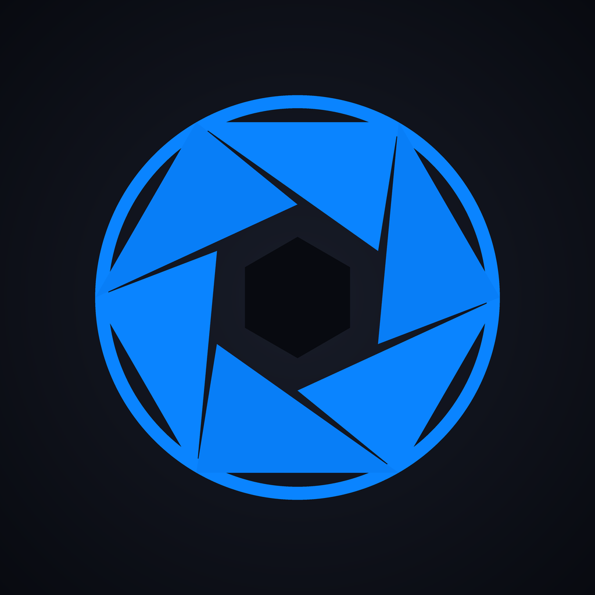

<div align="center">



<h1>Long Exposures</h1>

<p><strong>Turn your Live Photos and videos into real long-exposure photographs.</strong><br/></p>

<p>
  
  
  
  
</p>

</div>

---

## What it does

Long Exposures is an iOS app that turns your Live Photos and videos into real long-exposure shots. Pick a frame range. Choose a blend mode. Get motion blur, light trails, or glassy reflections without a tripod.

---

## How it works

<div align="center">

</div>

<br/>

| Step | What happens |
|---|---|
| **Import** | Your Live Photo's paired video (or any video clip) is decoded frame by frame — up to 120 frames, evenly sampled. Temp files are deleted the moment decoding finishes. |
| **Select** | A scrollable thumbnail strip lets you drag two handles to pick exactly which frames enter the blend. |
| **Align** | Vision estimates a per-frame translation and snaps the static background sharp, so handheld shake doesn't smear the scene you care about. |
| **Match exposure** | Per-channel brightness gains correct the camera's auto-metering flicker between frames, so the blend comes out clean rather than banded. |
| **Smooth motion** | Optical flow synthesizes in-between samples on the GPU, so fast subjects blur into a continuous streak instead of the discrete ghost copies a ~30 fps source leaves. |
| **Blend** | A Metal GPU pipeline accumulates your frames in linear light and resolves them to sRGB. Three modes: **Average** for motion blur, **Lighten** for light trails, **Darken** for reflections and shadows. |
| **Export** | Full-resolution render → JPEG, saved to the in-app library or straight to Photos. |

---

## Features

- **Live Photo & video import** — any clip in your library works
- **In-app capture** with locked exposure and white balance for consistent frames
- **Interactive timeline** — see every frame, drag to choose your range
- **Three blend modes** — Average · Lighten · Darken
- **Frame alignment** — keeps the background sharp on handheld shots
- **Exposure matching** — kills brightness flicker between frames
- **Motion smoothing** — optical-flow in-betweens turn ghosted streaks continuous
- **Before / After** — hold the preview to compare against the original frame
- **In-app library** — browse, share, or save past exposures
- **No account. No upload. No network.** All processing happens on your device.

---

## Tech stack

| Layer | Technology |
|---|---|
| UI | SwiftUI |
| GPU blend | Metal compute shaders |
| Frame decode | AVFoundation (`AVAssetReader`) |
| Registration | Vision (`VNTranslationalImageRegistrationRequest`) |
| Motion smoothing | Vision (`VNGenerateOpticalFlowRequest`) + Metal warp kernel |
| Color ops | Core Image |
| Photo access | PhotoKit |
| Capture | AVCaptureSession |

No third-party packages. iOS 17+, iPhone only.

---

## Repository layout

```
long-exposures/           ← Xcode project
  Engine/
    BlendEngine.swift     ← Metal accumulate + resolve pipeline
    BlendKernels.metal    ← GPU kernels (average / lighten / darken / resolve)
  Services/
    ImportService.swift   ← PHAsset / video → CVPixelBuffer frames
    RegistrationService.swift  ← Vision frame alignment
    NormalizationService.swift ← Per-frame exposure matching
    OpticalFlowService.swift   ← Per-pair dense flow for motion smoothing
    ExportService.swift   ← Full-res render + save
    CaptureService.swift  ← In-app locked-exposure video capture
    LibraryStore.swift    ← On-device JPEG library + index
  Models/
    FrameStore.swift      ← Full-res + preview buffer store
    EditorViewModel.swift ← Selection state, debounced preview re-blend
    Exposure.swift        ← Codable metadata for saved exposures
    AppSettings.swift     ← UserDefaults-backed defaults
  Views/
    EditorView.swift      ← Preview canvas + controls
    TimelineStrip.swift   ← Draggable range timeline
    CaptureView.swift     ← Live camera preview + record button
    LibraryView.swift     ← Saved exposures grid + detail
    OnboardingView.swift  ← First-launch walkthrough
    PermissionPriming.swift ← Pre-permission explanation sheets
landing/                  ← Marketing site (React + Vite → Vercel)
```
